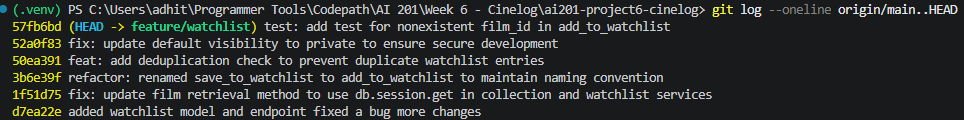

# PR Response Doc: CineLog Watchlist Feature

## AI Usage
I used Claude Code throughout this project in a few specific ways:

- **Rebase conflict diagnosis:** When rebasing feature/watchlist onto main, I hit a conflict in models.py that I didn't fully understand at first. I asked Claude to walk me through what git rebase and git fetch actually do (replay vs. merge, why it keeps history linear) and to explain the specific conflict I was looking at. It turned out main had already migrated Film.id from an integer to a UUID before my branch diverged, so my new WatchlistEntry.film_id column (still typed as an integer) no longer matched the foreign key. I asked it to explain this rather than just fix it, then I resolved the conflict and updated the field type myself, and used git log --merges to confirm no merge commits were left in the history afterward.
- **Stress-testing the default visibility argument (Comment 4):** I asked Claude to walk through the tradeoffs of defaulting a new watchlist entry's public field to True vs. False. It pushed back on my first instinct (public by default, matching a "share with friends" use case) by pointing out that there is no endpoint yet that enforces who can view another user's watchlist, so a public default would expose data with nothing actually checking the public flag. That argument is why I switched the default to private in the code and in my response to Comment 4.
- **Verifying commit message conventions:** I pasted my commit log and asked whether it followed Conventional Commits formatting. It flagged that my rename commit should have been refactor: instead of fix: (no behavior changed) and that my test-only commit should have been test: instead of fix:. I relabeled those commit types myself afterward.
- **Test pattern replication:** I pointed Claude at test_collection.py and asked it to help me write tests for the new watchlist service following that file's existing fixture/pattern conventions, which is how test_watchlist.py's structure (app/sample_user/sample_film fixtures, one test per behavior) came about.

In each case I made the final call on the actual position, code, or wording; I used AI as a second pair of eyes for diagnosing errors, checking conventions, and pressure-testing my reasoning rather than generating unreviewed answers.

## Comment 1: Rename
**What I did:** I renamed all instances of save_to_watchlist() to add_to_watchlist to mirror the add_to_collection naming convention and find-replace all instances to reflect that. This improves the readability of the codebase for new developers navigating through.
**How I verified:** This passed the default test suite and proves to be functional as per spec after code changes.

## Comment 2: Deduplication
**What I did:** I mirrored the duplication logic from collection_service.py to ensure duplicates are filtered out in the watchlist_service.py with an error raised for duplicates. Further Claude recommended me to add a DB-level UniqueConstraint on WatchlistEntry and an IntegrityError catch as a race-condition backstop that add_to_collection() itself doesn't have so I used AI to implement that.
**How I verified:** This passed the default test suite and proves to be functional as per spec after code changes. Later I implemented a watchlist test to ensure this code change still works along with the subsequent code changes to ensure the watchlist feature is robust and versatile.

## Comment 3: Missing test
**What I did:** I added a test_watchlist.py and realized I have to write similar tests for watchlist_service to check if the first 3 comments are fixed so I wrote those.
**How I verified:** I ran the updated test suite with add_watchlist tests for creating new entries, duplicates check, and nonexistent film check.

## Comment 4: Default visibility
**My position:** The watchlist's `public` field should default to `False` (private) for now.
**Reasoning:** Watchlists could make sense as public/shareable long-term, since users may like showing friends what they plan to watch. However, until there are endpoints established for other users viewing each others' watchlists, defaulting to public unnecessarily leaves the app vulnerable to security issues since there's no secure viewpoint for cross-user visibility yet. The default should be set to private until that's built.
**Tradeoff acknowledged:** While public may be best for this app's long-term purpose, it should be noted that users may skip over warnings and save items to their list, thinking their list is public and shareable with friends when it defaults to private. This may backfire into a source of user frustration if not dealt with properly (e.g. via clear UI messaging once sharing is implemented).

## Comment 5: Sort order
**My position:** I agree with the comment advocating for a change to date added sorting order.
**Reasoning:** That seems like a more intuitive format for adding and removing from watchlist and watching shows based on what is more freshly on user's minds.
**Engagement with reviewer's point:** The reviewer's point mirrors how get_collection() already sorts (newest first by date_added), so this also brings the watchlist in line with the rest of the app's conventions instead of being the one view sorted differently (alphabetically by title). I changed get_watchlist() in watchlist_service.py to order by WatchlistEntry.date_added.desc(), matching add_to_collection()'s pattern.

## Comment 6: Rebase
**What conflicted:** Two conflicts were present. First, .gitignore had a textual conflict. My feature/watchlist branch added .pytest_cache/ while main independently added .venv/ and venv/. Second, main had already migrated Film.id to a UUID (db.String(36)) before my branch diverged, but my new WatchlistEntry model (which didn't exist on main) still defined film_id as db.Integer, so it no longer matched the Film foreign key.
**How I resolved it:** I resolved this by keeping the union of both and committing as is. Next I resolved the data type conflict by updating all the models.py fields to reflect the UUID format requested in the assignment.
**How I verified no conflict remains:** I verified this with the help of Claude through the git log --merges command to ensure and empty merge commit history and the test suite check to make sure everything works.

## PR Description

### Overview
This PR adds the watchlist feature to CineLog: users can save films they intend to watch and view their saved list. It mirrors the existing collection feature's structure (model, service, routes) and includes:
- `add_to_watchlist(user_id, film_id)`: adds a film to a user's watchlist, raising `FilmNotFoundError` if the film does not exist and `AlreadyInCollectionError` if it is already on the watchlist (checked both at the application level and enforced by a DB-level unique constraint).
- `get_watchlist(user_id)`: returns all films on a user's watchlist.
- `GET /watchlist/<user_id>`: returns a user's watchlist as JSON.
- `POST /watchlist/<user_id>/add`: adds a film to a user's watchlist given a `film_id` in the request body.

### Design decisions
- **Default visibility:** `WatchlistEntry.public` defaults to `False` (private). Watchlists could reasonably become a public/shareable feature later, but since there is no endpoint or authorization check yet for viewing another user's watchlist, defaulting to public would expose data with no way to enforce who can see it. Private-by-default fails safe until sharing is actually implemented.
- **Sort order:** `get_watchlist()` returns entries ordered by `date_added` descending (most recently added first), matching `get_collection()`'s existing convention, rather than sorting alphabetically by title. This keeps the app consistent and surfaces what the user most recently decided to watch.

### Manual testing steps
1. Start the app locally and ensure the database is migrated/created (`db.create_all()` via the app's normal startup, or run the project's existing setup steps).
2. Create a user and a film (via the existing collection feature's setup, or directly via the database/shell) and note their IDs.
3. Add a film to the watchlist:
   ```
   POST /watchlist/<user_id>/add
   Content-Type: application/json

   { "film_id": "<film_id>" }
   ```
   Expect a `201` response with the new watchlist entry, including `"public": false`.
4. Try adding the same film again with the same request. Expect an error indicating the film is already in the watchlist (no duplicate row created).
5. Try adding a nonexistent `film_id`. Expect a "film not found" error, not a raw database error.
6. View the watchlist:
   ```
   GET /watchlist/<user_id>
   ```
   Expect a JSON array of films, each including `date_added` and `public: false`.
7. Add a second film and confirm it appears first in the response (newest `date_added` first).

